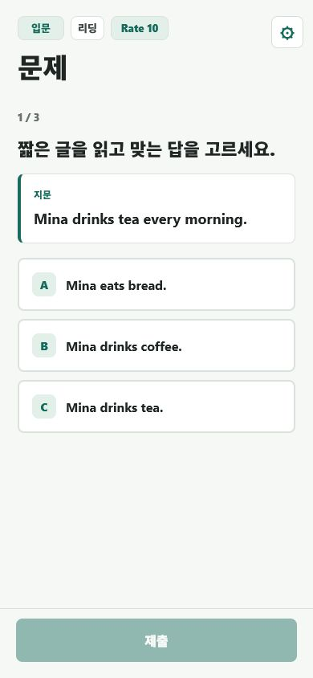
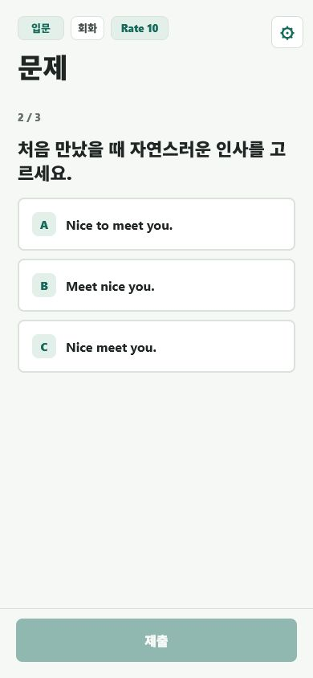
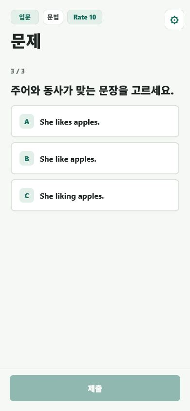
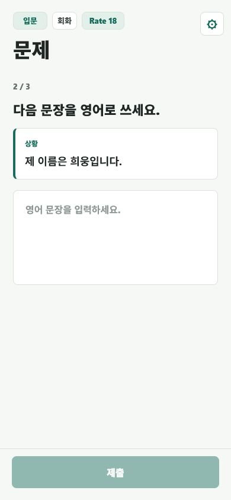
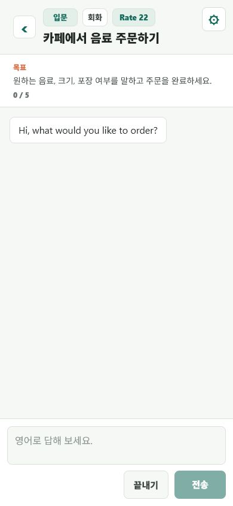
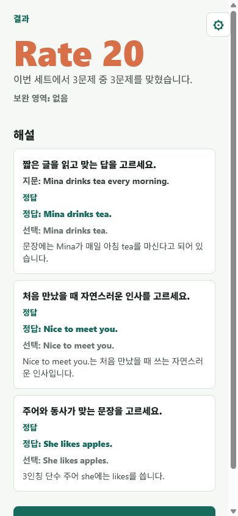

<p align="center">
  
</p>

# 레벨핏영어

레벨핏영어는 사용자의 현재 학습 수준에 맞춰 영어 문제, 회화 연습, 승급 시험을 이어 주는 모바일 영어 학습 앱입니다.

앱을 켜면 복잡한 메뉴를 먼저 보여주기보다, 지금 풀어야 할 학습 활동으로 바로 이어지는 흐름을 목표로 합니다.

## 플레이스토어 다운로드

[Google Play에서 다운로드](https://play.google.com/store/apps/details?id=com.LevelFitEnglish.LevelFitEnglish)

## 목적

이 프로젝트의 목적은 사용자가 매번 학습 범위를 직접 고르지 않아도, 현재 실력에 맞는 문제를 풀고 자연스럽게 다음 단계로 이동할 수 있게 만드는 것입니다.

기본 학습 흐름은 다음과 같습니다.

```text
앱 실행
-> 현재 레벨과 Rate 확인
-> 문제 풀이 또는 회화 연습
-> 해설과 약점 확인
-> Rate 갱신
-> 승급 가능 시 승급 시험 진행
-> 통과하면 다음 레벨로 이동
```

레벨핏영어는 짧게 자주 학습하는 사용자를 기준으로 설계했습니다. 한 번에 긴 강의를 듣는 방식보다, 작은 문제 묶음을 반복하면서 약점을 확인하고 다음 학습으로 넘어가는 경험에 집중합니다.

## 주요 기능

- **레벨 기반 학습**: A1, A2, B1, B2 레벨을 기준으로 문제와 회화 시나리오를 제공합니다.
- **Rate 시스템**: 사용자의 현재 학습 상태를 숫자로 기록하고, 결과에 따라 Rate를 갱신합니다.
- **승급 시험**: Rate가 기준에 도달하면 별도의 승급 시험을 통해 다음 레벨 이동 여부를 결정합니다.
- **문제 풀이**: 리딩, 회화, 문법 영역의 선택형 문제와 서술형 문제를 제공합니다.
- **AI 서술형 피드백**: 짧은 영어 답변을 서버에서 평가하고, 점수와 교정 피드백을 제공합니다.
- **AI 회화 연습**: 상황별 역할극 시나리오에서 사용자의 답변을 분석하고 다음 대화를 이어갑니다.
- **약점 기록**: 틀린 영역과 스킬 태그를 저장해 이후 학습에서 약점 중심으로 문제를 고를 수 있습니다.
- **원격 콘텐츠 업데이트**: Firebase Hosting의 문제팩과 회화 시나리오를 불러오고, 로컬 캐시로도 동작할 수 있게 구성했습니다.
- **로컬 학습 상태 저장**: 학습 레벨, Rate, 최근 결과, 약점 통계를 기기에 저장합니다.
- **광고 설정 지원**: Android 앱에서 Google Mobile Ads 설정을 사용할 수 있습니다.

## 앱 화면

실제 앱을 웹 미리보기로 실행한 뒤 모바일 화면 크기에서 캡처한 이미지입니다.

| 리딩 선택형 문제 | 회화 선택형 문제 | 문법 선택형 문제 |
| --- | --- | --- |
|  |  |  |

| 영작 서술형 문제 | AI 회화 연습 | 결과와 해설 |
| --- | --- | --- |
|  |  |  |

## 기술 스택

- **앱**: Expo, React Native, React, TypeScript
- **상태 저장**: AsyncStorage 기반 로컬 학습 상태 저장
- **테스트**: Vitest, TypeScript typecheck
- **서버**: Firebase Functions, Node.js 22
- **호스팅**: Firebase Hosting
- **AI 연동**: OpenAI Responses API
- **광고**: `react-native-google-mobile-ads`

## 프로젝트 구조

```text
.
|-- app/                         # Expo React Native 앱
|   |-- src/components/           # 재사용 UI 컴포넌트
|   |-- src/screens/              # 문제, 결과, 회화, 승급 화면
|   |-- src/services/             # 학습 흐름, 저장소, 콘텐츠 로딩, AI 연동
|   |-- src/data/                 # 앱에 포함된 기본 문제와 시나리오 데이터
|   |-- src/types/                # 학습, 회화, 평가 타입
|   |-- assets/                   # 앱 아이콘, 스플래시, 효과음
|   `-- scripts/                  # 콘텐츠 검증과 Android 빌드 스크립트
|-- server/                       # Firebase Functions API 서버
|-- public/                       # Firebase Hosting 콘텐츠와 개인정보처리방침
|-- docs/                         # 기획, QA, 개발 문서
|-- test-fixtures/                # 테스트용 fixture
|-- firebase.json                 # Firebase Functions/Hosting 설정
`-- package.json                  # 루트 실행 스크립트
```
