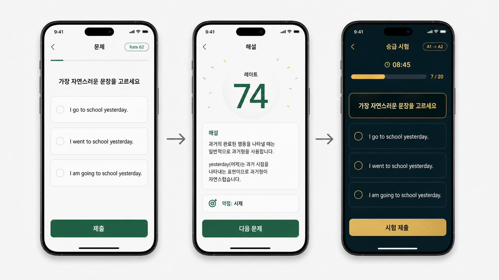

# 화면 설계 문서

## 1. 기준 목업

이 화면 설계는 아래 목업을 기준으로 한다.



목업의 핵심 구조를 그대로 따른다.

```text
문제 화면
-> 해설 + 레이트 화면
-> 승급 시험 화면
```

앱에는 복잡한 홈 화면을 먼저 보여주지 않는다. 사용자가 앱을 열면 로컬 학습 상태를 불러온 뒤 바로 문제 화면으로 진입한다.

## 2. 전체 화면 흐름

```text
앱 실행
-> LocalLearningState 로드
-> 일반 문제 세션 시작
-> 문제 제출
-> 세션 완료
-> 해설 + 레이트 표시
-> Rate 기준 미달: 다음 일반 문제
-> Rate 기준 도달: 승급 시험 시작
-> 승급 시험 제출
-> 승급 결과
-> 다음 문제
```

## 3. 공통 UI 원칙

- 첫 화면은 항상 문제다.
- 일반 학습 화면은 밝고 가볍게 만든다.
- 승급 시험 화면은 일반 학습과 명확히 다르게 만든다.
- 카드 그리드, 메뉴형 홈, 긴 온보딩은 사용하지 않는다.
- 한 화면에서 사용자가 해야 할 행동은 하나만 명확히 보여준다.
- 텍스트는 한국어 안내와 영어 문제를 함께 사용할 수 있다.
- 둥근 모서리는 8px 이하로 절제한다.

## 4. 화면 1: 일반 문제 화면

### 목적

사용자가 앱을 열자마자 바로 문제를 풀게 하는 화면이다.

### 진입 조건

- 앱 실행 후 로컬 학습 상태 로드 완료
- 승급 시험 진행 중이 아님
- 현재 레벨에 맞는 일반 문제 세션이 준비됨

### 화면 구성

상단:

- 화면 제목: `문제`
- 현재 레벨: 예시 `A1`
- 현재 레이트 칩: 예시 `Rate 62`

본문:

- 문제 지시문
- 문제 본문
- 선택형 답안 또는 입력 영역

하단:

- 기본 버튼: `제출`

### 목업 반영

목업의 첫 번째 화면처럼 밝은 배경과 단순한 문제 중심 레이아웃을 사용한다.

예시 화면 구조:

```text
문제                         Rate 62

가장 자연스러운 문장을 고르세요

[ A. I want a coffee.  ]
[ B. I want coffee a.  ]
[ C. I wants a coffee. ]

[ 제출 ]
```

### 상태

```ts
type PracticeQuestionState = {
  mode: 'practice';
  level: 'A1' | 'A2' | 'B1' | 'B2';
  rate: number;
  currentQuestionIndex: number;
  totalQuestionCount: number;
  selectedAnswerId?: string;
  canSubmit: boolean;
};
```

### 동작

- 답을 선택하기 전에는 제출 버튼을 비활성화한다.
- 답을 선택하면 제출 버튼을 활성화한다.
- 제출하면 다음 문제로 이동한다.
- 세션의 마지막 문제를 제출하면 해설 + 레이트 화면으로 이동한다.

## 5. 화면 2: 해설 + 레이트 화면

### 목적

사용자가 방금 푼 문제 묶음의 결과를 확인하고, 새 레이트와 다음 행동을 알 수 있게 한다.

### 진입 조건

- 일반 문제 세션 완료
- 모든 문제 채점 완료
- 레이트 계산 완료

### 화면 구성

상단:

- 화면 제목: `해설`

본문:

- 새 레이트: 예시 `Rate 74`
- 이번 세션 요약
- 문제별 해설
- 약점 라벨: 예시 `약점: 시제`

하단:

- 기준 미달 시 버튼: `다음 문제`
- 기준 도달 시 버튼: `승급 시험 시작`

### 목업 반영

목업의 두 번째 화면처럼 레이트 숫자를 가장 눈에 띄게 보여준다. 해설은 짧고 읽기 쉽게 유지한다.

예시 화면 구조:

```text
해설

Rate 74

이번 문제 묶음에서 3문제 중 2문제를 맞혔습니다.

해설
- "I want a coffee."가 자연스럽습니다.
- "coffee a"는 관사의 위치가 잘못되었습니다.

약점: 시제

[ 다음 문제 ]
```

레이트 기준을 넘은 경우:

```text
Rate 82

승급 시험을 볼 수 있습니다.

[ 승급 시험 시작 ]
```

### 상태

```ts
type PracticeResultState = {
  mode: 'practiceResult';
  previousRate: number;
  nextRate: number;
  score: number;
  totalQuestionCount: number;
  explanations: QuestionExplanation[];
  weakPointLabel?: string;
  promotionReady: boolean;
};
```

### 동작

- `promotionReady`가 `false`이면 `다음 문제` 버튼을 보여준다.
- `promotionReady`가 `true`이면 `승급 시험 시작` 버튼을 주요 버튼으로 보여준다.
- `다음 문제`를 누르면 새 일반 문제 세션으로 이동한다.
- `승급 시험 시작`을 누르면 승급 시험 화면으로 이동한다.

## 6. 화면 3: 승급 시험 화면

### 목적

현재 레벨에서 다음 레벨로 올라갈 수 있는지 확인한다.

### 진입 조건

- 일반 문제 결과에서 레이트가 기준 이상
- 기본 기준: `Rate >= 80`
- 사용자가 `승급 시험 시작` 버튼을 누름

### 화면 구성

상단:

- 화면 제목: `승급 시험`
- 승급 배지: 예시 `A1 -> A2`
- 진행률: 예시 `문제 2 / 5`
- 제한 시간 또는 남은 시간: 예시 `03:20`

본문:

- 시험 문제
- 답안 선택 영역

하단:

- 버튼: `시험 제출`

### 목업 반영

목업의 세 번째 화면처럼 어두운 배경과 금색 포인트를 사용한다. 일반 문제 화면과 분위기가 확실히 달라야 한다.

예시 화면 구조:

```text
승급 시험
A1 -> A2

문제 2 / 5        03:20

가장 자연스러운 문장을 고르세요.

[ A ]
[ B ]
[ C ]

[ 시험 제출 ]
```

### 시각 스타일

- 배경: 어두운 녹색 또는 남색
- 포인트 색상: 금색 계열
- 일반 문제보다 긴장감 있는 톤
- 해설 영역 없음
- 불필요한 장식 없음

### 상태

```ts
type PromotionExamState = {
  mode: 'promotionExam';
  fromLevel: 'A1' | 'A2' | 'B1';
  toLevel: 'A2' | 'B1' | 'B2';
  currentQuestionIndex: number;
  totalQuestionCount: number;
  remainingSeconds?: number;
  selectedAnswerId?: string;
  canSubmit: boolean;
};
```

### 동작

- 시험 중에는 문제별 해설을 보여주지 않는다.
- 각 문제 제출 후 다음 시험 문제로 이동한다.
- 마지막 문제 제출 후 승급 결과 화면으로 이동한다.
- 시험 중 이탈 처리 방식은 구현 설계 단계에서 결정한다.

## 7. 화면 4: 승급 결과 화면

### 목적

승급 시험 결과를 단순하게 보여주고 다음 학습으로 연결한다.

### 진입 조건

- 승급 시험의 모든 문제 제출 완료
- 시험 점수 계산 완료

### 통과 화면

```text
승급 성공

A1 -> A2

새로운 단계의 문제가 시작됩니다.

[ 다음 문제 시작 ]
```

### 실패 화면

```text
현재 단계 유지

조금 더 연습한 뒤 다시 승급 시험에 도전하세요.

[ 계속 연습하기 ]
```

### 상태

```ts
type PromotionResultState = {
  mode: 'promotionResult';
  passed: boolean;
  fromLevel: 'A1' | 'A2' | 'B1';
  toLevel: 'A2' | 'B1' | 'B2';
  score: number;
  passScore: number;
  nextRate: number;
};
```

### 동작

- 통과하면 `currentLevel`을 다음 단계로 올린다.
- 통과하면 `currentRate`를 새 단계의 시작 레이트로 초기화한다.
- 실패하면 현재 레벨을 유지한다.
- 실패 후 레이트 조정 방식은 구현 설계 단계에서 확정한다.

## 8. 화면 전환 규칙

```text
PracticeQuestion
-> PracticeResult

PracticeResult + promotionReady false
-> PracticeQuestion

PracticeResult + promotionReady true
-> PromotionExam

PromotionExam
-> PromotionResult

PromotionResult
-> PracticeQuestion
```

## 9. 로컬 상태 업데이트 시점

로컬 저장은 다음 시점에 수행한다.

- 일반 문제 세션 완료 후 레이트가 계산되었을 때
- 승급 시험 진입 상태가 활성화되었을 때
- 승급 시험 결과가 계산되었을 때
- 레벨이 변경되었을 때

## 10. 구현 전 확정해야 할 값

현재 문서의 기본값:

- 일반 세션 문제 수: 3
- 승급 시험 문제 수: 5
- 승급 가능 레이트: 80
- 승급 시험 통과 점수: 80

이 값들은 구현 설계 단계에서 상수로 분리한다.
