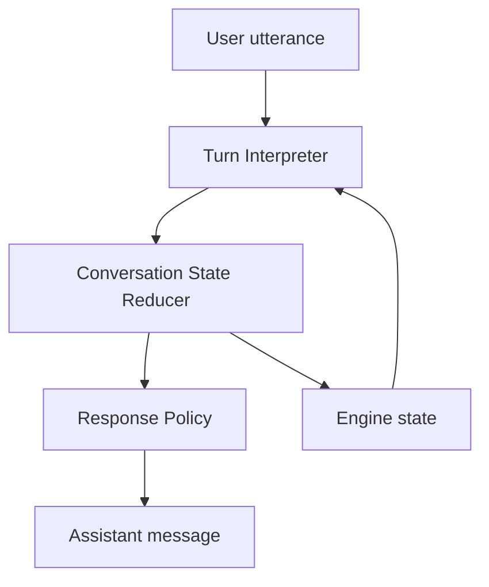

# Conversation Engine v2 Design

## 목적

현재 회화 기능은 시나리오의 `requiredSlots.matchKeywords`와 LLM 응답 보정에 크게 의존한다. 이 방식은 사용자가 예상 가능한 표현을 쓰면 동작하지만, 사용자가 전혀 엉뚱한 말을 하거나 목표와 비슷하지만 키워드가 다른 말을 하면 같은 질문이 반복될 수 있다.

Conversation Engine v2의 목표는 다음과 같다.

- 사용자의 예측 불가능한 답변은 LLM이 의미 단위로 해석한다.
- 대화 진행, 반복 방지, 종료 조건은 코드의 결정론적 상태머신이 강제한다.
- LLM이 잘못된 응답을 만들거나 같은 질문을 반복해도 앱은 같은 루프에 빠지지 않는다.
- 서버 API와 앱 fallback이 같은 정책을 따른다.
- 회화 결과 평가에는 성공, 중단, 실패 이유가 명확히 반영된다.

## 범위

### 포함

- 회화 세션 상태 모델 재정의
- 사용자 발화 해석 결과 JSON 스키마 정의
- 결정론적 상태머신 설계
- 반복 방지 정책
- off-topic, no-progress, unclear 발화 처리
- 서버 `/api/conversation/respond` 정규화 정책 개편
- 앱 fallback 응답 정책 개편
- 회귀 테스트 기준 정의

### 제외

- 음성 인식, 음성 합성, 효과음, 애니메이션
- Firebase API 인증과 사용량 제한
- 회화 시나리오 대량 생성
- 완전 자유 대화형 튜터
- 모든 레거시 회화 시나리오 문구 재작성

Firebase API 인증과 사용량 제한은 보안상 필요하지만, 현재 사용자는 "나만 쓸 것"이라는 전제로 우선순위를 낮췄다. 이 문서는 회화 엔진의 대화 안정성에 집중한다.

배포는 허용한다. 단, 이 결정은 "개인 테스트용"이라는 명시적 전제에 따른다. 공개 링크 공유, 앱 배포 확대, 사용자 증가 전에는 API 인증과 rate limit을 별도 작업으로 먼저 처리해야 한다.

## 핵심 원칙

1. LLM은 판단 보조자이고, 최종 진행 제어자는 상태머신이다.
2. 같은 assistant 질문을 같은 세션에서 연속으로 반복하지 않는다.
3. 사용자가 목표 달성에 기여하지 못한 턴은 `noProgress`로 기록한다.
4. off-topic과 unclear는 실패 누적으로 계산한다.
5. 목표 달성 전 LLM이 종료를 요청해도 상태머신이 막는다.
6. 목표 달성 후 LLM이 계속 질문해도 상태머신이 종료한다.
7. 최대 턴 도달 또는 반복 실패 종료는 성공 메시지가 아니라 리뷰 전환 메시지로 끝난다.

## 리뷰 반영 결정

문서 리뷰에서 나온 P0/P1 지적을 반영해 다음 결정을 고정한다.

- `engineState`는 v2 회화 세션의 단일 진실 공급원이다.
- 서버는 매 응답마다 다음 `engineState`를 반환하고, 앱은 이를 다음 요청에 반드시 다시 보낸다.
- `engineState`가 없는 legacy 세션은 transcript에서 `filledSlotKeys`와 `userTurnCount`만 복원한다. 반복 카운터, off-topic 카운터, unclear 카운터는 0부터 시작한다.
- 서버와 앱은 이번 구현에서 하나의 shared package를 만들지 않는다. 앱 TypeScript 엔진과 서버 ESM 엔진을 같은 테스트 fixture로 맞추는 "mirrored implementation"으로 시작한다.
- LLM은 actor가 아니라 interpreter다. `/api/conversation/respond`는 LLM에게 `TurnInterpretation`만 받는다.
- 최종 assistant message, 종료 여부, 종료 이유는 항상 상태머신과 Response Policy가 결정한다.
- `no_progress`는 v2의 공식 종료 이유로 추가한다. 기존 호환을 위해 optional 필드가 아니라 타입과 서버 JSON schema를 함께 확장한다.

## 기존 문제

### 문제 1: 키워드 슬롯의 취약성

예를 들어 약국 시나리오에서 `How often should I take it?`은 인식하지만 `Do you have any medicine for stomachache?`는 인식하지 못하면 같은 질문이 반복된다. 키워드를 계속 추가하면 특정 사례는 해결되지만, 다른 자연어 표현에서 같은 문제가 다시 생긴다.

### 문제 2: 반복 방지 상태가 없다

현재 로직은 다음 질문을 `missingSlots[0].prompt`로 고른다. 사용자가 계속 엉뚱한 말을 하면 같은 슬롯이 계속 missing 상태이고 같은 prompt가 반복된다.

### 문제 3: 실패 유형이 좁다

앱 fallback은 `isUnderstandable`이 false일 때만 실패 카운트를 올린다. 사용자가 영어로 말했지만 상황과 관련 없는 말을 하면 understandable=true, relevant=false가 되어 실패 누적이 충분히 일어나지 않는다.

### 문제 4: LLM과 코드의 책임 경계가 흐리다

LLM이 응답 문장, 종료 여부, 대화 진행을 동시에 판단하면 제어가 불안정해진다. 반대로 코드가 키워드만 보면 자연어 다양성을 처리하지 못한다.

## 제안 아키텍처

Conversation Engine v2는 네 단계로 동작한다.



### 1. Scenario Contract

시나리오는 여전히 목표 기반 데이터다. 다만 엔진은 단순 키워드가 아니라 의미 단위 슬롯으로 다룬다.

```ts
type ConversationSlot = {
  key: string;
  label: string;
  prompt: string;
  matchKeywords: string[];
  required?: boolean;
};
```

v2에서는 기존 타입을 바로 깨지 않고 다음 의미를 추가로 부여한다.

- `key`: 상태머신에서 추적하는 목표 단위
- `label`: 평가와 LLM 해석에 쓰는 사람이 읽을 수 있는 이름
- `prompt`: 슬롯이 비었을 때 물어볼 기본 질문
- `matchKeywords`: fallback 해석에서 쓰는 보조 힌트

LLM 해석은 `label`, `prompt`, `matchKeywords`, `successCriteria`, `userGoalKo`, `targetExpressions`를 함께 본다.

### 2. Turn Interpreter

Turn Interpreter는 사용자의 최신 발화를 구조화한다. LLM 사용 가능 시 서버에서 LLM이 담당하고, API 실패 시 앱 fallback이 규칙 기반으로 최소 해석한다.

LLM 출력은 자유문장이 아니라 다음 JSON으로 제한한다.

```ts
type TurnInterpretation = {
  isUnderstandable: boolean;
  isOnTopic: boolean;
  turnType: 'progress' | 'no_progress' | 'off_topic' | 'unclear';
  filledSlotKeys: string[];
  correctedSentence: string | null;
  detectedIssueTags: SkillTag[];
  shortReasonKo: string | null;
  confidence: number;
};
```

규칙:

- `filledSlotKeys`는 실제 시나리오의 required slot key만 허용한다.
- `confidence`가 낮으면 슬롯 완료로 인정하지 않는다.
- `isOnTopic=false`이면 슬롯이 채워져도 reducer가 보수적으로 처리한다.
- `isUnderstandable=false`이면 `turnType='unclear'`다.
- `isUnderstandable=true`이고 `isOnTopic=false`이면 `turnType='off_topic'`이다.
- 새 슬롯을 채우면 `turnType='progress'`다.
- 이해 가능하고 on-topic이지만 새 슬롯이 없으면 `turnType='no_progress'`다.
- LLM은 `shouldEndSession`을 결정하지 않는다.

### 3. Conversation State Reducer

Reducer는 이전 상태와 최신 해석 결과를 받아 새 상태를 만든다.

```ts
type ConversationEngineState = {
  filledSlotKeys: string[];
  pendingSlotKey: string | null;
  lastPromptKey: string | null;
  lastAssistantActionKey: string | null;
  lastTurnType: 'progress' | 'no_progress' | 'off_topic' | 'unclear' | null;
  repeatedPromptCount: number;
  noProgressCount: number;
  offTopicCount: number;
  unclearCount: number;
  userTurnCount: number;
  status: 'active' | 'completed' | 'ended';
  endReason: 'goal_completed' | 'max_turns' | 'too_many_failures' | 'no_progress' | null;
};
```

```ts
type ConversationEngineEndReason =
  | 'goal_completed'
  | 'max_turns'
  | 'too_many_failures'
  | 'no_progress'
  | null;
```

Reducer 규칙:

- `pendingSlotKey`는 아직 채워지지 않은 첫 번째 required slot key다. 모두 채워졌으면 `null`이다.
- 새 슬롯이 채워지면 `filledSlotKeys`에 병합하고 `noProgressCount`, `repeatedPromptCount`를 0으로 리셋한다.
- 새 슬롯이 없고 `turnType='no_progress'`이면 `noProgressCount`를 1 올린다.
- `turnType='off_topic'`이면 `offTopicCount`와 `noProgressCount`를 1 올린다.
- `turnType='unclear'`이면 `unclearCount`와 `noProgressCount`를 1 올린다.
- 이번 턴 후의 `pendingSlotKey`가 이전 턴의 `pendingSlotKey`와 같고 새 슬롯이 없으면 `repeatedPromptCount`를 1 올린다.
- 이번 턴 후의 `pendingSlotKey`가 바뀌었거나 새 슬롯이 채워지면 `repeatedPromptCount`를 0으로 리셋한다.
- `lastTurnType`은 이번 턴의 최종 `turnType`으로 저장한다.
- `lastPromptKey`와 `lastAssistantActionKey`는 Response Policy가 메시지를 선택한 뒤 저장한다.

종료 이유 우선순위:

1. 모든 required slot이 채워지면 `status='completed'`, `endReason='goal_completed'`.
2. `offTopicCount + unclearCount >= 3`이면 `status='ended'`, `endReason='too_many_failures'`.
3. `noProgressCount >= 3`이면 `status='ended'`, `endReason='no_progress'`.
4. `userTurnCount >= maxUserTurns`이면 `status='ended'`, `endReason='max_turns'`.
5. 그 외에는 `status='active'`, `endReason=null`.

따라서 off-topic 3회와 no-progress 3회가 동시에 성립하면 `too_many_failures`가 이긴다. 사용자가 on-topic이지만 같은 목표에서 진행하지 못한 경우에만 `no_progress`가 대표 종료 이유가 된다.

### 4. Response Policy

Response Policy는 상태에 따라 assistant 메시지를 고른다.

우선순위:

1. `goal_completed`: 시나리오 완료 메시지
2. `max_turns`: "Let's stop here and review your conversation."
3. `too_many_failures`: "Let's stop here and review your English together."
4. `no_progress`: "Let's stop here and review this situation together."
5. `unclear`: repairPolicy.unclear 또는 koreanOnly
6. `off_topic`: repairPolicy.offTopic
7. missing slot 있음: pending slot의 prompt 또는 escalated prompt

반복 방지:

- 여기서 "같은 질문"은 완전히 같은 문장만이 아니라 같은 slot intent를 다시 묻는 행위를 뜻한다.
- `lastAssistantActionKey`는 `${pendingSlotKey}:base`, `${pendingSlotKey}:hint`, `${pendingSlotKey}:example`, `repair:off_topic`, `repair:unclear` 형식으로 저장한다.
- 같은 `pendingSlotKey`에서 `repeatedPromptCount=0`이면 기본 prompt를 보낸다.
- 같은 `pendingSlotKey`에서 `repeatedPromptCount=1`이면 기본 prompt를 반복하지 않고 힌트 문장을 보낸다.
- 같은 `pendingSlotKey`에서 `repeatedPromptCount=2`이면 예시 문장을 보낸다.
- 네 번째 no-progress 전에 `no_progress` 종료 조건이 먼저 작동한다.
- 같은 `lastAssistantActionKey`가 연속으로 선택되면 다음 단계의 action으로 강제 승급한다.

예시:

```text
Turn 1 prompt: What symptoms do you have?
Turn 2 same slot: This situation needs your symptom. Try: "I have a headache."
Turn 3 same slot: One simple answer is enough: "I have a stomachache."
Turn 4: end and evaluate
```

## API 설계

### Request

현재 request와 호환되도록 유지한다.

```ts
type ConversationRespondRequest = {
  scenario: Scenario;
  userMessage: string;
  messages: ConversationMessage[];
  failureCount: number;
  engineState?: ConversationEngineState;
};
```

`engineState`가 있으면 반드시 우선 사용한다. v2 새 세션에서는 앱이 `engineState`를 항상 저장하고 다음 요청에 포함해야 한다.

`failureCount`는 legacy 호환 필드다.

- `engineState`가 있으면 서버는 `failureCount`를 진행 판단에 사용하지 않는다.
- v2의 실패 수는 `engineState.offTopicCount + engineState.unclearCount`에서 파생한다.
- 앱은 기존 `ConversationSession.failureCount` 저장값을 유지하되, v2 세션에서는 `engineState.offTopicCount + engineState.unclearCount`로 동기화한다.
- `engineState`가 없는 legacy request에서만 `failureCount`를 `unclearCount` 초기값으로 사용할 수 있다.

`engineState`가 없으면 legacy bootstrap으로 처리한다.

- transcript에서 required slot completion과 `userTurnCount`만 복원한다.
- `noProgressCount`, `offTopicCount`, `unclearCount`, `repeatedPromptCount`는 0으로 시작한다.
- `lastPromptKey`, `lastAssistantActionKey`, `lastTurnType`은 `null`로 시작한다.
- 이 제한은 의도적이다. 기존 transcript만으로 과거 발화의 off-topic/unclear 여부를 신뢰성 있게 재구성하지 않는다.

### Response

기존 클라이언트와 호환되도록 기존 필드는 유지하고, v2 필드를 추가한다.

```ts
type ActorApiResponse = {
  message: string;
  isUserUnderstandable: boolean;
  isUserRelevant: boolean;
  shouldEndSession: boolean;
  endReason: 'goal_completed' | 'max_turns' | 'too_many_failures' | 'no_progress' | null;
  detectedIssueTags: SkillTag[];
  correctedSentence: string | null;
  shortReasonKo: string | null;
  engineState: ConversationEngineState;
};
```

앱은 `engineState`를 다음 요청에 다시 보낸다. v2 서버는 항상 `engineState`를 반환한다.

## 서버 책임

서버는 다음을 담당한다.

- LLM에 최신 사용자 발화를 해석하게 한다. 이 호출은 `TurnInterpretation`만 반환한다.
- LLM 응답을 스키마로 검증한다.
- 해석 결과를 reducer에 넣어 상태를 갱신한다.
- Response Policy로 최종 메시지와 종료 여부를 결정한다.

서버 LLM 출력 스키마:

```ts
type InterpreterApiOutput = {
  interpretation: TurnInterpretation;
};
```

assistant message는 LLM 출력에 포함하지 않는다. 모든 assistant message는 Response Policy가 deterministic template에서 고른다. 자연스러움보다 반복 방지와 평가 가능한 흐름을 우선한다.

서버는 다음을 하지 않는다.

- LLM의 `shouldEndSession`을 그대로 믿지 않는다.
- LLM의 자유문장을 검증 없이 앱으로 보내지 않는다.
- 시나리오별 if문을 계속 늘리지 않는다.

## 앱 fallback 책임

앱 fallback은 API 실패 시 최소한의 대화를 유지한다.

- 기존 `matchKeywords`로 슬롯을 채운다.
- off-topic, unclear, no-progress를 실패로 누적한다.
- 같은 prompt 반복 방지 정책을 서버와 동일하게 적용한다.
- 성공하지 못한 종료는 평가 화면으로 보낸다.

Fallback은 LLM 수준의 의미 해석을 목표로 하지 않는다. 하지만 루프 방지는 반드시 보장한다.

Fallback classification 규칙:

- 입력이 비어 있거나 기호만 있거나 한글만 있으면 `turnType='unclear'`.
- 입력이 required slot keyword 또는 supplemental matcher와 매칭되면 `turnType='progress'`.
- 입력이 영어이고 시나리오 vocabulary, target expression, slot label/prompt 중 하나와 부분적으로 관련 있으면 `turnType='no_progress'`.
- 입력이 영어이지만 시나리오와 관련된 단어가 없으면 `turnType='off_topic'`.
- fallback의 `confidence`는 keyword match이면 1.0, supplemental match이면 0.8, 그 외는 0.4 이하로 둔다.

서버와 앱의 엔진 일치 전략:

- 이번 구현에서는 shared package를 만들지 않는다.
- 앱에는 `app/src/services/conversationEngine.ts`를 둔다.
- 서버에는 `server/conversationEngine.mjs`를 둔다.
- 두 파일은 같은 상태 타입, 같은 reducer 우선순위, 같은 fixture 기반 테스트를 가져야 한다.
- 중복 구현은 의도적 임시 선택이다. React Native Metro와 Firebase Functions ESM 빌드 경계를 새 패키지로 묶는 작업은 이번 범위에서 제외한다.

## 평가 반영

회화 평가 요청에는 종료 이유와 엔진 상태를 포함한다.

```ts
type ConversationEvaluateRequest = {
  scenario: Scenario;
  messages: ConversationMessage[];
  communicationFailureCount: number;
  engineState: ConversationEngineState | null;
  endReason: ConversationEngineEndReason;
};
```

`communicationFailureCount`도 legacy 호환 필드다.

- `engineState`가 있으면 평가는 `engineState.offTopicCount + engineState.unclearCount`를 실패 수로 사용한다.
- `engineState`가 없을 때만 `communicationFailureCount`를 사용한다.
- 평가 결과 저장 시 v2 세션의 failure count는 engine state에서 파생한 값을 저장한다.

평가 정책:

- `goal_completed`: 일반 회화 평가
- `max_turns`: 완료 못 한 슬롯을 약점으로 반영
- `too_many_failures`: clarity, taskCompletion 낮게 반영
- `no_progress`: taskCompletion 낮게 반영하고 "같은 목표에서 진행이 멈춤"을 피드백

점수 보정 규칙:

- `goal_completed`는 LLM 평가 점수를 그대로 사용하되 0-100 범위로 clamp한다.
- `max_turns`는 `taskCompletion`을 최대 20점으로 제한한다.
- `no_progress`는 `taskCompletion`을 최대 14점, `clarity`를 최대 18점으로 제한한다.
- `too_many_failures`는 `taskCompletion`을 최대 10점, `clarity`를 최대 12점으로 제한한다.
- missing required slot 하나당 `taskCompletion`에서 4점을 추가 차감하되 0점 미만으로 내리지 않는다.
- feedback에는 종료 이유와 첫 번째 missing slot label을 한국어로 포함한다.
- LLM 평가 API가 실패하면 deterministic fallback 평가를 만든다. fallback 총점은 `goal_completed=70`, `max_turns=45`, `no_progress=35`, `too_many_failures=25`를 기준으로 한다.

## 사용자 경험

사용자는 같은 질문을 기계적으로 반복해서 보지 않아야 한다.

허용되는 흐름:

```text
AI: What symptoms do you have?
User: I like soccer.
AI: Let us come back to the pharmacy. Tell me your symptom.
User: I went to school yesterday.
AI: Try saying your symptom, for example: "I have a headache."
User: Banana.
AI: Let's stop here and review your English together.
```

허용되지 않는 흐름:

```text
AI: What symptoms do you have?
User: I like soccer.
AI: What symptoms do you have?
User: I went to school yesterday.
AI: What symptoms do you have?
```

## 테스트 기준

### Pure Engine Tests

- 새 슬롯이 채워지면 `noProgressCount`가 0이 된다.
- off-topic 3회면 `too_many_failures`로 종료한다.
- on-topic이지만 새 슬롯이 없는 턴 3회면 `no_progress`로 종료한다.
- 모든 required slot이 채워지면 `goal_completed`로 종료한다.
- 최대 턴에 도달하면 `max_turns`로 종료한다.
- 같은 prompt가 연속으로 반환되지 않는다.
- off-topic과 no-progress 종료 조건이 동시에 성립하면 `too_many_failures`가 우선한다.

### Server Tests

- LLM이 같은 질문을 반복하면 policy가 교체한다.
- LLM이 required slot 미완료 상태에서 종료를 요청하면 막는다.
- LLM이 required slot 완료 상태에서 계속 질문하면 종료한다.
- `engineState` 없이 messages만 들어오면 `filledSlotKeys`와 `userTurnCount`만 legacy bootstrap하고 반복/실패 카운터는 0으로 시작한다.

### App Tests

- fallback actor가 off-topic을 실패로 누적한다.
- fallback actor가 no-progress를 실패로 누적한다.
- fallback actor가 같은 질문을 반복하지 않는다.
- API response의 `engineState`를 다음 요청에 전달한다.

### Regression Cases

- 약국: 증상 말한 뒤 "Do you have any medicine for stomachache?"는 완료된다.
- 약국: 엉뚱한 말을 3번 하면 같은 질문 반복 대신 리뷰로 종료된다.
- 식당: 주문 의도가 다양한 문장으로 들어와도 한 슬롯에서 반복하지 않는다.
- 공항: 이미 여권을 제시했으면 여권을 다시 묻지 않는다.

## 구현 단계

### Phase 1: Pure Engine and App Fallback

1. 앱 타입에 `ConversationEngineState`, `TurnInterpretation`, `ConversationEngineEndReason`을 추가한다.
2. `app/src/services/conversationEngine.ts`를 만든다.
3. reducer, response policy, fallback classification을 순수 함수로 구현한다.
4. 앱 fallback actor가 새 엔진을 사용하게 한다.
5. 앱 세션에 `engineState`를 저장하고 `getActorResponse` 요청에 포함한다.
6. 앱 단위 테스트로 no-progress, off-topic, repeated prompt, goal completion을 검증한다.

### Phase 2: Server Interpreter and Policy

1. `server/conversationEngine.mjs`를 만든다.
2. 앱 엔진 테스트와 같은 fixture를 서버 테스트에도 추가한다.
3. `/api/conversation/respond`의 LLM schema를 `InterpreterApiOutput`으로 바꾼다.
4. server reducer와 response policy가 최종 message/endReason/engineState를 결정하게 한다.
5. legacy `messages` bootstrap을 구현한다.
6. Firebase Functions를 배포한다.

### Phase 3: Evaluation Integration

1. evaluation request에 `engineState`와 `endReason`을 추가한다.
2. evaluation normalize 단계에서 점수 보정 규칙을 적용한다.
3. missing slot feedback을 한국어 summary/weakness에 포함한다.
4. 관련 테스트를 추가한다.

### Phase 4: Release Verification

1. 전체 테스트와 타입체크를 실행한다.
2. live `/api/conversation/respond`에 off-topic/no-progress 회귀 케이스를 호출한다.
3. 로컬 Gradle release APK를 빌드한다.
4. `C:\Users\woung\Desktop\이력서\app-release.apk`에 덮어쓴다.
5. 변경분을 커밋한다.

## 마이그레이션 전략

현재 저장된 회화 세션은 `engineState`가 없다. 따라서 v2는 다음 전략을 쓴다.

- 기존 세션에는 `engineState`가 없어도 동작한다.
- 서버와 앱은 messages에서 `filledSlotKeys`와 `userTurnCount`만 복원한다.
- 반복/실패 카운터는 legacy bootstrap에서 복원하지 않는다.
- 새 세션부터 `engineState`를 저장한다.
- v2 응답부터 `engineState`는 필수 필드다.

## 성공 기준

- 사용자가 off-topic 발화를 반복해도 같은 assistant 문장이 무한히 반복되지 않는다.
- 회화 목표 달성 여부는 LLM이 아니라 상태머신으로 결정된다.
- LLM 응답이 이상해도 종료 조건과 반복 방지는 코드가 보장한다.
- 모든 기존 회화 시나리오가 기존보다 나쁜 루프로 빠지지 않는다.
- 테스트와 타입체크가 통과한다.
- Firebase 배포와 APK 빌드가 완료된다.

## 남은 리스크

- LLM 해석이 틀리면 잘못된 슬롯이 채워질 수 있다. `confidence`와 slot key allowlist로 완화한다.
- app fallback은 LLM이 없으므로 의미 해석 품질은 제한적이다. 하지만 반복 방지는 보장한다.
- 공개 API의 사용량 제한은 별도 보안 작업으로 남아 있다.
- 기존 시나리오의 `matchKeywords` 품질이 낮으면 fallback 정확도는 제한된다.
